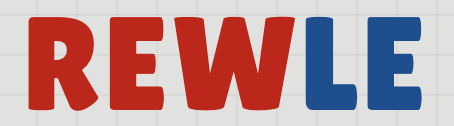

<!-- PROJECT LOGO -->
 

  

<h3 align="center">REWLE</h3>

  

    A Wordle-like daily guessing game for Rewe products!
     
    <a href="https://github.com/Hound21/rewle"><strong>Explore the docs »</strong></a>
     
     
    <a href="">View Game</a>
    ·
    <a href="https://github.com/Hound21/rewle/issues">Report Bug</a>
    ·
    <a href="https://github.com/Hound21/rewle/issues">Request Feature</a>
  

  

<!-- ABOUT THE PROJECT -->
## About The Project

[![Product Name Screen Shot][product-screenshot]](TODO)

Guess the REWLE in 6 tries.

* Incorrect guesses will help guide you to the target price.

If you guess within 3% of the target price, you win!

A new REWLE is available every day!

(<a href="#readme-top">back to top</a>)

<!-- ACKNOWLEDGMENTS -->
## Acknowledgments

This project would not have been possible without the following resources:

* [Rewe](https://www.rewe.de/)
* [Wordle](https://www.nytimes.com/games/wordle/index.html)
* [Costcodle](https://costcodle.com/)
* [Best-README-Template](https://github.com/othneildrew/Best-README-Template/)

(<a href="#readme-top">back to top</a>)

<!-- MARKDOWN LINKS & IMAGES -->
<!-- https://www.markdownguide.org/basic-syntax/#reference-style-links -->
[product-screenshot]: assets/rewle-game.png